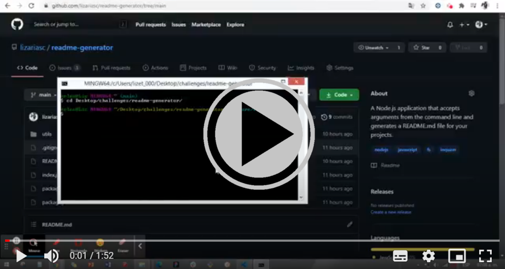

  # README.md Generator

  ## Description
  A Node.js Application that accepts arguments from the command-line and generates a README.md file for your projects.

  ## Table of Contents

* [Installation](#installation)
* [Usage](#usage)
* [License](#license)
* [Contributing](#contributing)
* [Tests](#tests)
* [Questions](#questions)

## Installation 
The user needs to have Node.js installed, clone the repo, run npm init and npm install for the dependencies. After that, run node 'index.js' to start the application, answer all the prompted questions and your README.md file will be created in the root directory of the Application.

## Usage
Allow developers to create professional and quality README files for their projects.

## License

## Contributing
Contributor Covenant

## Tests
No tests needed.

## Questions
If you have any questions about this project, send me an email at lizethariasc14@gmail.com or contact me through my [GitHub](https://github.com/lizariasc)

## Application Demo Video

